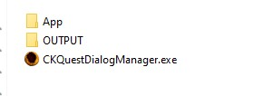
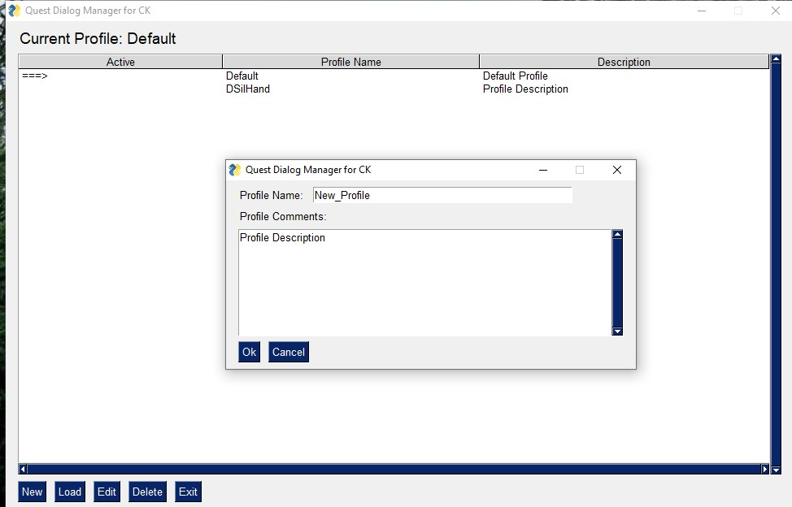
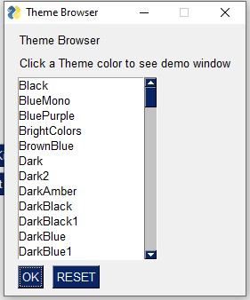
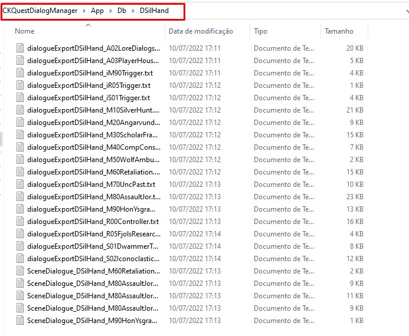
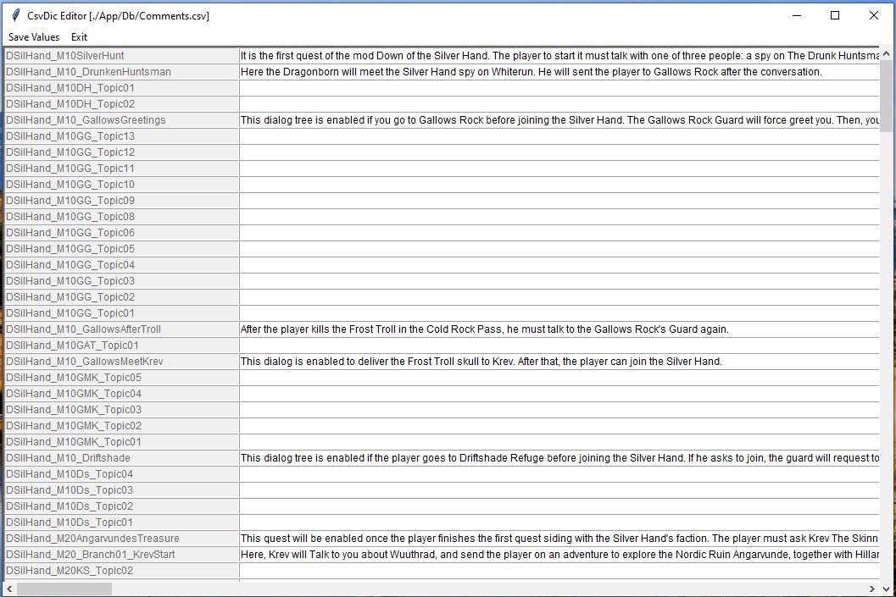

# Application Manual

## Application folder 

CK's Quest Dialog Manager does not require installation, just unzip the files to use. It is structured as follows:

>   
> *CKQuestDialogManager application's folder structure.*

* App: This folder contains all the necessary files for the application to function properly.

* OUTPUT: This folder is generated after the application is run for the first time. It stores all generated documentation and reports.

* CKQuestDialogManager.exe: This is the executable file for the application.


## Main Window

> 
> *CKQuestDialogManager main window.*

When the application is launched, it will display a window with three main sections:

* Application Settings: Here, users can configure the application and access information about the application itself.
* Content Manager: This section provides tools for managing the quest content, such as finding, listing, opening, replacing, extracting information, and converting to different formats.
* Help: This section includes links to tutorials and other resources to assist users in using the application.


## Application Settings

### Settings

This section allows for basic configuration of the application. The settings typically do not need to be changed, but can be adjusted as needed.

* *Skyrim Path*: This is the most important configuration and should be set to the path where Skyrim is installed, typically `C:\\Program Files (x86)\\Steam\\steamapps\\common\\Skyrim`.

* *Docgen Folder*: This is the location where the generated documentation will be saved, typically the `OUTPUT` folder.

* *Sort by Name (true) or Form ID (false)*: This setting controls how the branches in the documentation are sorted. If set to true, they will be sorted in alphabetical order. If set to false, they will be sorted by Form ID.

>   
> *Settings window.*


### Profiles

The "Profile" feature in the CK Quest Dialog Manager allows mod developers to efficiently manage dialogs from multiple mods in different workspaces by keeping their imported assets separate. Each profile stores all of the settings and imported files from the Creation Kit.

When the application is first used, a "Default" profile is configured, but it can be renamed later to a more meaningful name. Additionally, users can assign different color schemes to each profile to help with identification. The profile management window clearly indicates which profile is currently active, and users can add comments or a description to each profile to further aid in organization. The Profile's window also allows for the creation, loading, editing, and deletion of profiles. It's important to note that the deletion option is permanent and cannot be undone.

>   
> *Profiele management window.*

>   
> *Profile editing window.*

>   
> *Profile creation window.*


### Choose Theme

In this section, you can customize the visual appearance of the application by selecting a color theme for each individual profile. There are a wide range of options available to suit your preferences and personalize the look of your workspace.

>   
> *Window for color theme selection.*


###  About and License

In this section, you can find information about the application, including its version number and developer credits. Additionally, the Open Source license under which the application is distributed is also displayed here. This information is provided to ensure transparency and compliance with the terms of the license.


## Content Manager

### Step 1: Import Objects

In the Content Manager section, the first step is to import dialog files from the Creation Kit. This is achieved by clicking the "Import files from the Creation Kit" button. This action is necessary before the application can be utilized in any way.

The imported files will be stored in the `App/Db/<Profile-Name>` folder, where "Profile-Name" is the name of the currently active profile. If the imported data becomes outdated, you can easily update it by importing the files again. Note that only the imported data will be replaced, so any changes made within the application, such as adding actor's names or comments, will be preserved.

>   
> *Imported files from creation kit.*


### Step 2: Edit

In the Content Manager section, the second step is to customize and add information to the imported data from the Creation Kit. The buttons in this section provide the following options:

* *Edit Actor's Names*: Allows you to specify custom names for NPCs in the generated documentation.

* *Edit Comments*: Allows you to add comments for quest elements that will be displayed in the generated documentation.

* *Edit Scene Order*: Allows you to choose the order in which scenes will appear in the generated documentation.

It is important to remember that all these changes will be saved in the profile and they will be used to generate the final documentation.

>   
> *Actors Names editor.*

>   
> *Comments editor.*

>   
> *Actors Names editor.*


### Step 3: Manage Quest Content

In the Content Manager section, step 3 offers two essential tools for managing the quest content:

**Generate Documentation**

This tool allows you to generate a human-readable documentation from the imported files, in four different formats: HTML, Docx, Markdown, and Json. The generated documentation will be saved in the output folder, as configured in the settings.

**Audio Manager Tools**

This window provides a set of tools to help manage all the audio files associated with the quest you imported in the first step. These tools are designed to make it easy to keep track of all your audio assets and ensure that they are correctly associated with the quest content. The tools include features such as organizing and renaming audio files, editing metadata, and converting files to different formats.

The tool screen can be divided into four segments:

>   
> *Audio manager tools.*

**(1) Table of imported audio tracks**

This table lists all imported tracks that were imported using the "Import files from the Creation Kit" button. In this section, you can select any track to execute actions. The tracks are organized by Quest ID, Actor ID, and Subtitles.

**(2) Audio Track Player/Details**

In this section, you can visualize the track name, subtitles, and the current file format of the track. Additionally, you can listen to the track using the track player menu.

**(3) Audio Track Tools section** 

In the Audio Track Tools section, you can perform a variety of actions on individual tracks or all tracks at once using the provided tools. When using tools that convert files into different formats, the source files will be kept and not deleted. However, if the target file already exists, it will be overwritten.

The tools available in this section include:

* Open Folder: Allows you to open the track's location in the Windows File Explorer.

* Copy Track Name: Copies the track's name to the clipboard
Track Info Details: Copies the track's details in JSON format to the clipboard.

* Generate Dialogue's Report: Creates an HTML report of information about all tracks in the output folder.

* Generate XWM: Converts the WAV track file into XWM format. If an MP3 file is available, it will first convert the file to WAV, and then to XWM.

* Generate FUZ: Combines the XWM and LIP files into a FUZ file. If an XWM file is not available, it will search for WAV or MP3 files instead.

* UnFUZ: Decomposes a FUZ file (if available) into XWM and LIP files.

* Generate FUZ for all: Creates FUZ files (combining XWM and LIP files) for all tracks

* Generate EMPTY audio: Creates an audio file with no sound. The length is calculated using an estimation equation that takes into account the total number of words, the words per minute (WPM). The lenght is calculated using an time-to-speak estimation equation:

```
reading_time = max [(total_words * 60)/wpm + padding_time, min_time]
```
Where:
* `wpm`: 110
* `padding_time`: 1s
* `min_time`: 2s
* `total_words`: estimation of amount of words.

