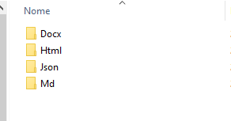
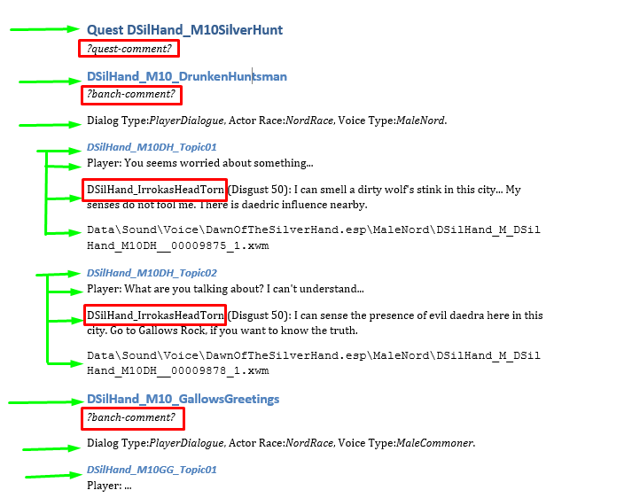

# CkDialogDocGen

CkDialogDocGen stands for Creation Kit Dialog Documentation Generator. Is a tool to help in generating beautiful and comprehensive documentation on readable formats, such as:
* Docx;
* Html;
* Markdown;
* Json.

# For who this tool is usefull?

**Short answer**: 

*For Skyrim modders who work on quests, and want to review or share its dialogs in a readable format.*

**Long answer**: 

When you create a new quest for the game, usually it will have dialogs and scenes, so the Dragonborn will be able to interact with other people in the world. 

So, as a mod developer, I wrote down a draft of the speeches and inserted it into the Creation Kit. But I found the process of reviewing the dialogs for correcting typos, fixing little things, and applying some changes, HORRIBLE AND TEDIOUS.

I had to click in dozens of boxes to find the text I wanted to review. Since changes were frequently applied to the dialogs, the drafts were completely outdated. 
When some people started to appear offering help, I had to provide the most current version of the story script, in a readable format. How should sustainably do that?

I saw that I need to find some way to auto-generate documentation for the dialogues, so I or another person could review the most updated version simply, always using the most recent version. 

Creating Kit allows you to export the dialogs in a (horrible to read as a human) CSV table, with lots of (frequently) useless information with no (easy to understand) context.

Once I finished it, I decided to share it in the community. Maybe it would be useful for someone else as well.

# Why would I need it?

* If you want to share the updated version of your dialogs in some quest with other people;

* If you want to review the dialogs of your quest in a simple way;

* Keep an updated version of your dialogs scripts.

# Tutorial

## Step 1: Preparing the quest

For the auto-generation of the documentation to work properly, when a dialog is spoken by a unique actor, he/she must be set on the "**Speaker:**" field on the **Topic Info** window.  

## Step 2: Export the dialogs from Creation Kit

To generate the documentation, CkDialogDocGen needs to export the dialogs from the Creation Kit.

Click on the button "Export Quest Dialog" on the "Quest Data" tab from your selected quest.

Then, click ok.

## Step 3: Configuring CkDialogDocGen

On CkDiagDocgen, click on settings.

* You must check if the "Skyrim Path" option is pointing to the Skyrim installation folder on your computer.
* The DocGen folder points to the folder where you want to save the generated documentation. You may leave it as it is, or change it to a different folder if you want to.
* Actors files point to the Actors' Names dictionary file. The default value is "Actors.csv", and usually there is no need to change it.
* Same for Comments.csv, you may leave it as it is.
* Sort by name or by FormId defines the sorting methods for the **Topics** in the same **Branch**. If you have a good name conversion, true should be the best option.

## Step 4: Previwing the documentation

At this point, you can already generate the documentation. 

First, we have to fill the dictionaries Actos.csv and Comments.csv. Click on "Export Objects to CSV files". 

A pop-up will be displayed with the list of files processed, and the Objects and actors found.  In this example, we exported the data from two quests: "DSilHand_M10SilverHunt", and "DSilHand_M80AssaultJor". 

Then click OK.

If you open the files Comments.csv or Actos.csv with a text editor or with a CSV editor*, you will notice that the listed actors and objects IDs were written right there. 

(*) Such as Libre Office Calc or Excel. But if you want to use a tool like that, you should use a semicolon (;) as a separator.

Now, you can generate the documentation, by clicking on the button "Generate Documentation".

It will display a pop-up with the quests it was able to generate the documentation.

If you enter the directory where the documentation was supposed to be generated, you will notice 4 subfolders:
* Docx;
* Html;
* Markdown;
* Json.
These are the formats the documentation will be generated in. They have the same content but in different formats.

Opening the document "DSilHand_M10SilverHunt.docx" generated for the first quest, you will see the following structure:

The document title is "Quest \<quest-ID\>", and a paragraph with the text ?quest-commenty?  The following subtitles are the Branchs IDs. 
First, it will have a text "?branch-comment?", followed by some useful information about this branch -- such as if the branch is a PlayerDialog or a Scene, the race, and the voice type of the speaking actor, and so on. 

Then, you are going to have a sub-subtitle for each topic in the branch. This subsection contains a player (if it applies) and a list of dialogs for the actor to who its branch belongs (if any). The actor is indicated by its ID and is followed by its mood and the file name for the voice audio.  

A first version for the documentation was already generated!
But it has some problems: 

* You may want to give some context for the branches, so the one who read the documentation may understand the context of the dialogues.  so who read the documentation can understand the context. 
* You may want to explain the quest history as well at the start of the document, for a better understanding of the whole picture of the dialogues, and how the branches connect.
* The characters have their actor's IDs, not their actual names at the start of the dialogues. 

Yes, you can write that information indirectly on your document, but if you regenerate the documentation again, you will have to rewrite the information all over again. 

For solving this issue we have the Comments.csv and Actors.csv files. 

## Step 5: Adding comments and naming the Actors

Open the Actors.csv file and the Comments.csv file with your favorite CSV or text editor, and add the Actual names for the actors and your commentaries for the quests and branches*.

After you are done, just save it. But keep in mind you must preserve the CSV format if you are using a CSV editor. 
If you are using a text editor, remember the separator is a semicolon.

**Note: You should not use semicolons on comments or Actors' names.**

(*) The current version of the documentation does not support comments for the Topics.

## Step 6: Generating the docuementation

Repeat the same procedure from Step 4: click on "Generate Documentation", and "OK".

**Note: You may click on "Export Objects to CSV files" many times you want to or need. No row from the tables is going to be removed, and its content removed. It will just add new blank rows (if necessary) at the end of the files.**

# Observations

* Whan you press the button "Export the Objects to CSV files", **it does not overwrite or erase any of the entries** are already on the files Actors.csv and Comments.csv. It only adds new entries. Therefore, the same CSV files can be used to generate the documentation for multiple quests from different mods, with no issue, as long the IDs for the objects are unique (as they should be).

* Make sure the documentation files are **CLOSED** after regenerating the documentation. It may lead to unexpected errors.

* This program has logged. Usually, you are not going to use them, but if some strange error occurs (and the documentation files are not closed), you may send them to me in my email (anderson dot paschoalon at gmail dot com), with a description of what you have done. If it is a bug, I will fix it as soon as possible. If it is not, I will fix it as soon as possible. Or, if it is not a bug, I'll improve the documentation.

