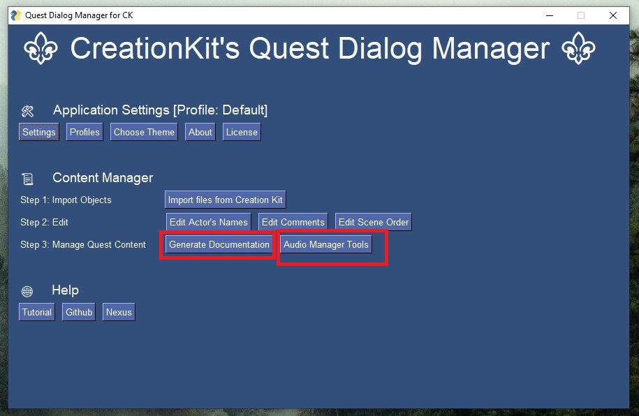
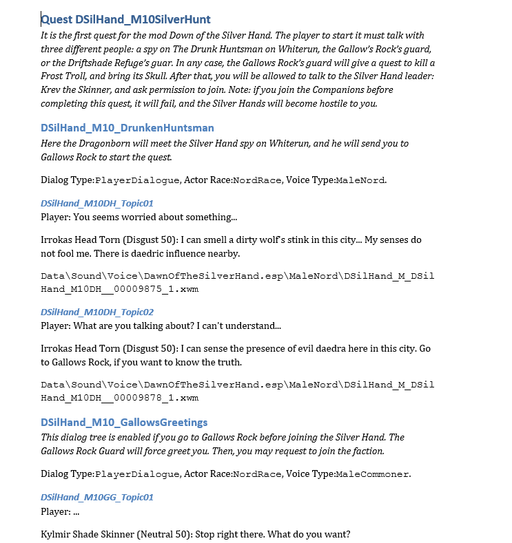

# Tutorial

## 1: Preparing the quest

To ensure that the auto-generation of documentation functions correctly, it is necessary to make a few adjustments to the quests in the Creation Kit. One important step is to ensure that the speaker for each dialog is correctly set in the "**Speaker**" field of the **Topic Info** window. This is particularly important when a dialog is spoken by a unique actor. The figure below illustrates where this option can be found within the Creation Kit interface.

>   
> *Location of the field "Speaker", in the Topic Info window. This field usually is optional, but it is really important to be properly filled in for this application to work properly.*

## 2: Export the dialogs from Creation Kit

In order to properly export the Quest Dialog data from the Creation Kit, follow these steps:

1. In the quest object editor, navigate to the "Quest Data" tab of the quest you want to manage.

2. Click on the "Export Scene Dialogue" button. A prompt will appear asking you to select the actors whose data you want to export. Select all actors associated with the mod you wish to manage.

3. Click on the "Export Quest Dialog" button on the "Quest Data" tab of your selected quest. Click "OK" to proceed.

>   
> *"Export Scene Dialog" and "Export Quest Dialog" buttons on the "Quest Data" tab.*

>  
> *Confirmation window.*

By following these steps, you will have properly exported all of the quest dialog data to text files. An example of the exported files can be seen in the image below.

>   
> *Files generated after clicking on both buttons for all quests you want to manage.*

## 3: Configuring the Application

To properly manage the dialogs of our quest, we need to import the data we previously exported from the Creation Kit. It is important to ensure that the application is configured correctly to point to the location of the exported files.

  

Here are a few things to check:

Verify that the "Skyrim Path" option is set to the correct location of your Skyrim installation folder on your computer.

Confirm that the DocGen folder is set to the desired location where you want to save the generated documentation. You can leave it as is, or change it to a different folder if you prefer.

The option to "Sort by name" or "Sort by FormId" determines the sorting method for the Topics within the same Branch. If your naming convention is consistent and logical, choosing "Sort by name" is likely the best option as it will sort them alphabetically. On the other hand, ordering by FormId will sort the branches by the order in which they were created. 

>   
> *Settings window.*

## 4: Previwing the documentation

At this point, you can begin generating the documentation. To do so, we need to first import the data from the Creation Kit. To start the import process, simply click on the "Import files from Creation Kit" button.

>   
> *Button Import files from Creation Kit.*

A pop-up window will appear, displaying a list of the files that were processed, as well as any objects and actors that were found. In this example, we exported data from two quests: "DSilHand_M10SilverHunt," and "DSilHand_M80AssaultJor." Once you have reviewed the list, click "OK" to proceed.

>   
> *Pop-up with imported objects summary.*

Next, you can generate the documentation by clicking on the "Generate Documentation" button. A pop-up window will appear, showing the quests for which documentation was successfully generated.

>   
> *Pop-up with imported quests.*

If you navigate to the directory where the documentation was saved, you will notice that four subfolders have been created: "Docx," "Html," "Markdown," and "Json." These subfolders contain the documentation in different formats, but the content of each format is the same.

>   
> *The structure of the OUTPUT directory after the generation of the documentation.* 

Additionally, if you click on the "Audio Manager Tools" button, you will be able to view a table of all audio tracks that were imported. This confirms that the data was imported correctly into the current profile.

>   
> *Main window.*

>   
> *Audio Manager.*

Upon opening the document "DSilHand_M10SilverHunt.docx" generated for the first quest, you will see the following structure:

* The document title is "Quest <quest-ID>," and it includes a paragraph with the text "quest-comment."

* The following subtitles are the Branch IDs. Each branch includes a text "?branch-comment?," followed by useful information about the branch, such as whether it is a PlayerDialog or a Scene, the race and voice type of the speaking actor, and so on.

* For each topic within the branch, there is a sub-subtitle that contains information about the player (if applicable) and a list of dialogs for the actor to whom the branch belongs (if any). The actor is identified by their ID, and their mood and voice audio file name are also included.

> 
> *Document without comments or named actors.*

While this is a good first version of the documentation, there are still few issues with it:

* It would be helpful to provide some context for the branches, so that readers can understand the context of the dialogues.
* The quest history should also be included at the beginning of the document, for a better understanding of the overall context and how the branches connect.
* The characters are identified by their actor IDs, rather than their actual names, at the beginning of the dialogues.

We will fix them right now.

## 5: Adding comments and naming the Actors

As you may have already realized, the main window of the Content Manager features three buttons in the "Step 2: Edit" subsection that allow you to improve the documentation and address the issues previously mentioned. These buttons are:

* "Edit Actor's Names"
* "Edit Comments"
* "Edit Scene Order"

These buttons enable you to easily edit and update the documentation in a structured way.

The first two buttons, "Edit Actor's Names" and "Edit Comments", both open a CSV editor. The first button allows you to edit the Actors.csv file, where you can assign actual names to the Actors, which will be used in the documentation instead of their IDs. 

> 
> *The Actors.csv Editor is a tool that allows you to specify the actual names of the actors in your documentation.*

The second button opens the Comments.csv file, which contains a list of all Quest Objects and allows you to include a description or context for each object. This information will be included in the generated documentation. Note that the current version of the documentation does not support comments for Topic objects.

> 
> *The Comments.csv Editor is a tool where you can add detailed descriptions and comments for Quests, Branches, and Scenes, which will be included in the generated documentation.*

The third button, "Edit Scene Order", allows you to edit the SceneOrder.csv file, which determines the order in which Scene Objects appear within a quest.

> 
> *The SceneOrder.csv Editor allows you to modify the order in which scenes appear in the generated documentation.*

These CSVs are located in the directory App/Db/, and can be edited manually using another CSV or text editor, but it is recommended to use the built-in tools to avoid corrupting the file structure.

## 6: Generating the final docuementation

To generate the final documentation, click the button "Generate Documentation" once more. If you have followed all the steps correctly, a comprehensive and visually appealing quest documentation will be generated, as shown in the screenshot below.

> 
> *The final output of the documentation generation process is a polished and comprehensive DOCX document, ready for review and distribution.*

## Final Remarks

* **It is important to note that any comments or actor names added to the CSV files will never be removed, only added. This means that you can click the "Import Files from Creation Kit" button as many times as you want without losing any information.**

* **Keeping your documentation up-to-date is easy. Simply export the files of the modified quests from the Creation Kit, and then use the CK Quest Dialog Manager's "Import files from Creation Kit" and "Generate Documentation" buttons to synchronize your quest scripts with the current content of the Creation Kit.**

* **To avoid any confusion, it is recommended to create separate profiles for each mod you want to manage.**

* **Make sure that the documentation files are closed after regenerating the documentation to avoid unexpected errors.**

* **This program has logging capabilities. In most cases, you will not need to use them, but in the event of a strange error occurring (and the documentation files are not closed), you can send them to me at anderson.paschoalon@gmail.com along with a description of the steps you took. If it is a bug, I will fix it as soon as possible. If it is not a bug, I will improve the documentation accordingly.**

