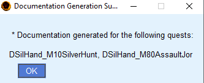

# Tutorial

## Step 1: Preparing the quest

To ensure that the auto-generation of documentation functions correctly, it is necessary to make a few adjustments to the quests in the Creation Kit. One important step is to ensure that the speaker for each dialog is correctly set in the "**Speaker**" field of the **Topic Info** window. This is particularly important when a dialog is spoken by a unique actor. The figure below illustrates where this option can be found within the Creation Kit interface.

>   
> *Location of the field "Speaker", in the Topic Info window. This field usually is optional, but it is really important to be properly filled in for this application to work properly.*

## Step 2: Export the dialogs from Creation Kit

In order to properly export the Quest Dialog data from the Creation Kit, follow these steps:

1. In the quest object editor, navigate to the "Quest Data" tab of the quest you want to manage.

2. Click on the "Export Scene Dialogue" button. A prompt will appear asking you to select the actors whose data you want to export. Select all actors associated with the mod you wish to manage.

3. Click on the "Export Quest Dialog" button on the "Quest Data" tab of your selected quest. Click "OK" to proceed.

>   
> *Buttons that must be clicked for each quest you want to manage the dialogs.*

>   
> *"Export Scene Dialog" and "Export Quest Dialog" buttons on the "Quest Data" tab.*

>  
> *Confirmation window.*

By following these steps, you will have properly exported all of the quest dialog data to text files. An example of the exported files can be seen in the image below.

>   
> *Exported files from Creation kit.*

## Step 3: Configuring the Application

To properly manage the dialogs of our quest, we need to import the data we previously exported from the Creation Kit. It is important to ensure that the application is configured correctly to point to the location of the exported files.

  

Here are a few things to check:

Verify that the "Skyrim Path" option is set to the correct location of your Skyrim installation folder on your computer.

Confirm that the DocGen folder is set to the desired location where you want to save the generated documentation. You can leave it as is, or change it to a different folder if you prefer.

The option to "Sort by name" or "Sort by FormId" determines the sorting method for the Topics within the same Branch. If your naming convention is consistent and logical, choosing "Sort by name" is likely the best option as it will sort them alphabetically. On the other hand, ordering by FormId will sort the branches by the order in which they were created. 

>   
> *Settings window.*

## Step 4: Previwing the documentation

At this point, you can begin generating the documentation. To do so, we need to first import the data from the Creation Kit. To start the import process, simply click on the "Import files from Creation Kit" button.

>   
> *Button Import files from Creation Kit.*

A pop-up window will appear, displaying a list of the files that were processed, as well as any objects and actors that were found. In this example, we exported data from two quests: "DSilHand_M10SilverHunt," and "DSilHand_M80AssaultJor." Once you have reviewed the list, click "OK" to proceed.

>   
> *Pop-up with imported objects summary.*

Next, you can generate the documentation by clicking on the "Generate Documentation" button. A pop-up window will appear, showing the quests for which documentation was successfully generated.

>   
> *Pop-up with imported quests.*

If you navigate to the directory where the documentation was saved, you will notice that four subfolders have been created: "Docx," "Html," "Markdown," and "Json." These subfolders contain the documentation in different formats, but the content of each format is the same.

>   
> *OUTPUT directory structure, after documentation generation.* 

Additionally, if you click on the "Audio Manager Tools" button, you will be able to view a table of all audio tracks that were imported. This confirms that the data was imported correctly into the current profile.

>   
> *Main window.*

>   
> *Audio Manager.*

Upon opening the document "DSilHand_M10SilverHunt.docx" generated for the first quest, you will see the following structure:

* The document title is "Quest <quest-ID>," and it includes a paragraph with the text "quest-comment."

* The following subtitles are the Branch IDs. Each branch includes a text "?branch-comment?," followed by useful information about the branch, such as whether it is a PlayerDialog or a Scene, the race and voice type of the speaking actor, and so on.

* For each topic within the branch, there is a sub-subtitle that contains information about the player (if applicable) and a list of dialogs for the actor to whom the branch belongs (if any). The actor is identified by their ID, and their mood and voice audio file name are also included.

> 
> *Document with no comments and named actors.*

While this is a good first version of the documentation, there are a few issues to keep in mind:

* It would be helpful to provide some context for the branches, so that readers can understand the context of the dialogues.
* The quest history should also be included at the beginning of the document, for a better understanding of the overall context and how the branches connect.
* The characters are identified by their actor IDs, rather than their actual names, at the beginning of the dialogues.

We will fix them right now.

++++++++++++++

## Step 5: Adding comments and naming the Actors

Open the Actors.csv file and the Comments.csv file with your favorite CSV or text editor, and add the Actual names for the actors and your commentaries for the quests and branches*.

After you are done, just save it. But keep in mind you must preserve the CSV format if you are using a CSV editor. 
If you are using a text editor, remember the separator is a semicolon.

**Note: You should not use semicolons on comments or Actors' names.**

(*) The current version of the documentation does not support comments for the Topics.

## Step 6: Generating the docuementation

Repeat the same procedure from Step 4: click on "Generate Documentation", and "OK".

**Note: You may click on "Export Objects to CSV files" many times you want to or need. No row from the tables is going to be removed, and its content removed. It will just add new blank rows (if necessary) at the end of the files.**

# Observations

* Whan you press the button "Export the Objects to CSV files", **it does not overwrite or erase any of the entries** are already on the files Actors.csv and Comments.csv. It only adds new entries. Therefore, the same CSV files can be used to generate the documentation for multiple quests from different mods, with no issue, as long the IDs for the objects are unique (as they should be).

* Make sure the documentation files are **CLOSED** after regenerating the documentation. It may lead to unexpected errors.

* This program has logged. Usually, you are not going to use them, but if some strange error occurs (and the documentation files are not closed), you may send them to me in my email (anderson dot paschoalon at gmail dot com), with a description of what you have done. If it is a bug, I will fix it as soon as possible. If it is not, I will fix it as soon as possible. Or, if it is not a bug, I'll improve the documentation.

================================================================
