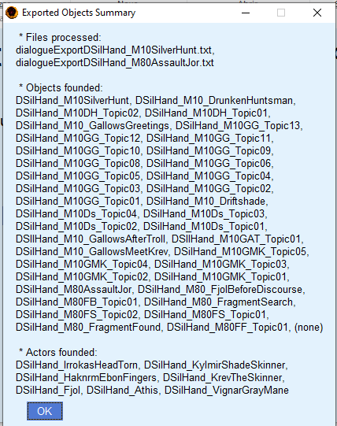
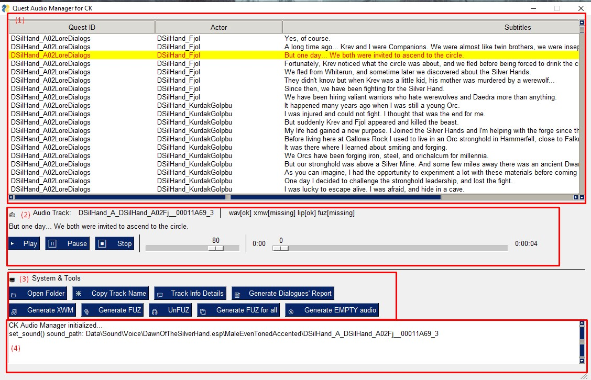

# 1. CK's Quest Dialog Manager


The Quest Dialog Manager, a feature of the Creation Kit, offers mod creators a simple solution for managing quest dialogs.

The tool allows for the export of dialog information from the Creation Kit to be imported and utilized in a streamlined content management system.


# 2. For Who this tool is usefull? 

## 2.1. Short answer 

*For Skyrim modders who:*

* *Want to review and share quest dialogs in a clear and readable format;*
* *Want to easily manage their dialog files, including finding, listing, opening, replacing, extracting information, and converting to different formats (such as mp3, wav, xwm, fuz).*

## 2.2 Long answer 

> 
> *Dialog View window in the creation kit.*

As a mod developer, creating new quests for the game of Skyrim often involves creating dialogs and scenes for the Dragonborn to interact with NPCs in the world. However, I found the process of reviewing and editing these dialogs to be tedious and time-consuming. I had to navigate through dozens of boxes in the Creation Kit to find the text I needed to review, and keeping track of changes was difficult as the drafts quickly became outdated.

When other people began to offer to help with the quest, I struggled to provide them with the most current version of the story script in a readable format. I realized that I needed a way to automatically generate documentation for the dialogs to make the review process easier and more efficient.

The Creation Kit allows for exporting dialogs in a CSV format, but it is difficult to read and understand without context. I decided to create a tool that could help me generate readable documentation automatically. Starting as a simple script, the tool eventually evolved into a content manager with multiple features that use the information imported from the Creation Kit.

With this tool, I can now easily:

* Create beautiful documentation for my quests in a variety of formats, including HTML, Markdown, DOCX, and JSON.

* Manage audio files from quests in an organized way. I can easily find, open, and play audio files according to their subtitle, extract information, and convert them to different formats.

* Generate mute audio files with approximate speaking times for the text in the audio.

After reaching a stable version, I decided to share it with the community on Nexus. I hope it will be useful for other mod developers as well.


================================================================
# 3. Tutorial


## Step 1: Preparing the quest

For the auto-generation of the documentation to work properly, when a dialog is spoken by a unique actor, he/she must be set on the "**Speaker:**" field on the **Topic Info** window.  In the figure down belows is indicated where this option is located.

> 
> *Location of the field "Speaker", in the Topic Info window. This field usually is optional, but it is really important to be properly filled in for this application to work properly.*

## Step 2: Export the dialogs from Creation Kit

To generate the documentation, CkQuestDialogManager needs to export the dialogs from the Creation Kit.

In the quest object editor, in the "Quest Data" tab of the quest you want to manage,  you must click on both button presented in the image down below: "Export Scene Dialogue" and "Export Quest Dialog".

> 
> *Buttons that must be clicked for each quest you want to manage the dialogs.*

For the first Button "Export Scene Dialog", you are going to be asked wich actor you want to export the data. Select all actors (one each time) of the mod you want to manage. 

Next, click on the button "Export Quest Dialog" on the "Quest Data" tab from your selected quest.

> 
> *"Export Scene Dialog" and "Export Quest Dialog" buttons on the "Quest Data" tab.*

Then, click ok.

>
> *Confirmation window.*

If you proceed well these steps, all the quest dialog data was properly exported to text files. In the image down below, we show an example of exported files.

> 
> *Exported files from Creation kit.*


## Step 3: Configuring CkDialogDocGen

On CkDiagDocgen, click on settings.


* You must check if the "Skyrim Path" option is pointing to the Skyrim installation folder on your computer.
* The DocGen folder points to the folder where you want to save the generated documentation. You may leave it as it is, or change it to a different folder if you want to.
* Sort by name or by FormId defines the sorting methods for the **Topics** in the same **Branch**. If you have a good name conversion, true should be the best option.

> 
> *Settings window.*


## Step 4: Previwing the documentation

At this point, you can already generate the documentation. We just have to import the data from Creation Kit. Click on "Import files from Creation Kit"


A pop-up will be displayed with the list of files processed, and the Objects and actors found.  In this example, we exported the data from two quests: "DSilHand_M10SilverHunt", and "DSilHand_M80AssaultJor". 



Then click OK.

If you open the files Comments.csv or Actos.csv with a text editor or with a CSV editor*, you will notice that the listed actors and objects IDs were written right there. 

(*) Such as Libre Office Calc or Excel. But if you want to use a tool like that, you should use a semicolon (;) as a separator.


Now, you can generate the documentation, by clicking on the button "Generate Documentation".


It will display a pop-up with the quests it was able to generate the documentation.


If you enter the directory where the documentation was supposed to be generated, you will notice 4 subfolders:
* Docx;
* Html;
* Markdown;
* Json.
These are the formats the documentation will be generated in. They have the same content but in different formats.


Opening the document "DSilHand_M10SilverHunt.docx" generated for the first quest, you will see the following structure:


The document title is "Quest \<quest-ID\>", and a paragraph with the text ?quest-commenty?  The following subtitles are the Branchs IDs. 
First, it will have a text "?branch-comment?", followed by some useful information about this branch -- such as if the branch is a PlayerDialog or a Scene, the race, and the voice type of the speaking actor, and so on. 

Then, you are going to have a sub-subtitle for each topic in the branch. This subsection contains a player (if it applies) and a list of dialogs for the actor to who its branch belongs (if any). The actor is indicated by its ID and is followed by its mood and the file name for the voice audio.  

A first version for the documentation was already generated!
But it has some problems: 

* You may want to give some context for the branches, so the one who read the documentation may understand the context of the dialogues.  so who read the documentation can understand the context. 
* You may want to explain the quest history as well at the start of the document, for a better understanding of the whole picture of the dialogues, and how the branches connect.
* The characters have their actor's IDs, not their actual names at the start of the dialogues. 

Yes, you can write that information indirectly on your document, but if you regenerate the documentation again, you will have to rewrite the information all over again. 

For solving this issue we have the Comments.csv and Actors.csv files. 


## Step 5: Adding comments and naming the Actors

Open the Actors.csv file and the Comments.csv file with your favorite CSV or text editor, and add the Actual names for the actors and your commentaries for the quests and branches*.

After you are done, just save it. But keep in mind you must preserve the CSV format if you are using a CSV editor. 
If you are using a text editor, remember the separator is a semicolon.

**Note: You should not use semicolons on comments or Actors' names.**


(*) The current version of the documentation does not support comments for the Topics.


## Step 6: Generating the docuementation

Repeat the same procedure from Step 4: click on "Generate Documentation", and "OK".

**Note: You may click on "Export Objects to CSV files" many times you want to or need. No row from the tables is going to be removed, and its content removed. It will just add new blank rows (if necessary) at the end of the files.**


# Observations

* Whan you press the button "Export the Objects to CSV files", **it does not overwrite or erase any of the entries** are already on the files Actors.csv and Comments.csv. It only adds new entries. Therefore, the same CSV files can be used to generate the documentation for multiple quests from different mods, with no issue, as long the IDs for the objects are unique (as they should be).

* Make sure the documentation files are **CLOSED** after regenerating the documentation. It may lead to unexpected errors.

* This program has logged. Usually, you are not going to use them, but if some strange error occurs (and the documentation files are not closed), you may send them to me in my email (anderson dot paschoalon at gmail dot com), with a description of what you have done. If it is a bug, I will fix it as soon as possible. If it is not, I will fix it as soon as possible. Or, if it is not a bug, I'll improve the documentation.


================================================================
# 4. Detailed Overview

## 4.1 Application folder 

CK's Quest Dialog Manager does not require installation, just unzip the files to use. It is structured as follows:

>  
> *CKQuestDialogManager application's folder structure.*

* App: This folder contains all the necessary files for the application to function properly.

* OUTPUT: This folder is generated after the application is run for the first time. It stores all generated documentation and reports.

* CKQuestDialogManager.exe: This is the executable file for the application.


## 4.2 Main Window

> 
> *CKQuestDialogManager main window.*

When the application is launched, it will display a window with three main sections:

* Application Settings: Here, users can configure the application and access information about the application itself.
* Content Manager: This section provides tools for managing the quest content, such as finding, listing, opening, replacing, extracting information, and converting to different formats.
* Help: This section includes links to tutorials and other resources to assist users in using the application.


## 4.3 Application Settings

### 4.3.1. Settings

This section allows for basic configuration of the application. The settings typically do not need to be changed, but can be adjusted as needed.

* *Skyrim Path*: This is the most important configuration and should be set to the path where Skyrim is installed, typically `C:\\Program Files (x86)\\Steam\\steamapps\\common\\Skyrim`.

* *Docgen Folder*: This is the location where the generated documentation will be saved, typically the `OUTPUT` folder.

* *Sort by Name (true) or Form ID (false)*: This setting controls how the branches in the documentation are sorted. If set to true, they will be sorted in alphabetical order. If set to false, they will be sorted by Form ID.

> 
> *Settings window.*


### 4.3.2. Profiles

The "Profile" feature in the CK Quest Dialog Manager allows mod developers to efficiently manage dialogs from multiple mods in different workspaces by keeping their imported assets separate. Each profile stores all of the settings and imported files from the Creation Kit.

When the application is first used, a "Default" profile is configured, but it can be renamed later to a more meaningful name. Additionally, users can assign different color schemes to each profile to help with identification. The profile management window clearly indicates which profile is currently active, and users can add comments or a description to each profile to further aid in organization. The Profile's window also allows for the creation, loading, editing, and deletion of profiles. It's important to note that the deletion option is permanent and cannot be undone.

> 
> *Profiele management window.*

> 
> *Profile editing window.*

> 
> *Profile creation window.*


### 4.3.3. Choose Theme

In this section, you can customize the visual appearance of the application by selecting a color theme for each individual profile. There are a wide range of options available to suit your preferences and personalize the look of your workspace.

> 
> *Window for color theme selection.*


### 4.3.4.  About and License

In this section, you can find information about the application, including its version number and developer credits. Additionally, the Open Source license under which the application is distributed is also displayed here. This information is provided to ensure transparency and compliance with the terms of the license.


## 4.4.  Content Manager

### 4.4.1 Step 1: Import Objects

In the Content Manager section, the first step is to import dialog files from the Creation Kit. This is achieved by clicking the "Import files from the Creation Kit" button. This action is necessary before the application can be utilized in any way.

The imported files will be stored in the `App/Db/<Profile-Name>` folder, where "Profile-Name" is the name of the currently active profile. If the imported data becomes outdated, you can easily update it by importing the files again. Note that only the imported data will be replaced, so any changes made within the application, such as adding actor's names or comments, will be preserved.

> 
> *Imported files from creation kit.*


### 4.4.2 Step 2: Edit

In the Content Manager section, the second step is to customize and add information to the imported data from the Creation Kit. The buttons in this section provide the following options:

* *Edit Actor's Names*: Allows you to specify custom names for NPCs in the generated documentation.

* *Edit Comments*: Allows you to add comments for quest elements that will be displayed in the generated documentation.

* *Edit Scene Order*: Allows you to choose the order in which scenes will appear in the generated documentation.

It is important to remember that all these changes will be saved in the profile and they will be used to generate the final documentation.

> 
> *Actors Names editor.*

> 
> *Comments editor.*

> 
> *Actors Names editor.*


### 4.4.3 Step 3: Manage Quest Content

In the Content Manager section, step 3 offers two essential tools for managing the quest content:

**Generate Documentation**

This tool allows you to generate a human-readable documentation from the imported files, in four different formats: HTML, Docx, Markdown, and Json. The generated documentation will be saved in the output folder, as configured in the settings.

**Audio Manager Tools**

This window provides a set of tools to help manage all the audio files associated with the quest you imported in the first step. These tools are designed to make it easy to keep track of all your audio assets and ensure that they are correctly associated with the quest content. The tools include features such as organizing and renaming audio files, editing metadata, and converting files to different formats.

The tool screen can be divided into four segments:

> 
> *Audio manager tools.*

**(1) Table of imported audio tracks**

This table lists all imported tracks that were imported using the "Import files from the Creation Kit" button. In this section, you can select any track to execute actions. The tracks are organized by Quest ID, Actor ID, and Subtitles.

**(2) Audio Track Player/Details**

In this section, you can visualize the track name, subtitles, and the current file format of the track. Additionally, you can listen to the track using the track player menu.

**(3) Audio Track Tools section** 

In the Audio Track Tools section, you can perform a variety of actions on individual tracks or all tracks at once using the provided tools. When using tools that convert files into different formats, the source files will be kept and not deleted. However, if the target file already exists, it will be overwritten.

The tools available in this section include:

* Open Folder: Allows you to open the track's location in the Windows File Explorer.

* Copy Track Name: Copies the track's name to the clipboard
Track Info Details: Copies the track's details in JSON format to the clipboard.

* Generate Dialogue's Report: Creates an HTML report of information about all tracks in the output folder.

* Generate XWM: Converts the WAV track file into XWM format. If an MP3 file is available, it will first convert the file to WAV, and then to XWM.

* Generate FUZ: Combines the XWM and LIP files into a FUZ file. If an XWM file is not available, it will search for WAV or MP3 files instead.

* UnFUZ: Decomposes a FUZ file (if available) into XWM and LIP files.

* Generate FUZ for all: Creates FUZ files (combining XWM and LIP files) for all tracks

* Generate EMPTY audio: Creates an audio file with no sound. The length is calculated using an estimation equation that takes into account the total number of words, the words per minute (WPM). The lenght is calculated using an time-to-speak estimation equation:

```
reading_time = max [(total_words * 60)/wpm + padding_time, min_time]
```
Where:
* `wpm`: 110
* `padding_time`: 1s
* `min_time`: 2s
* `total_words`: estimation of amount of words.

