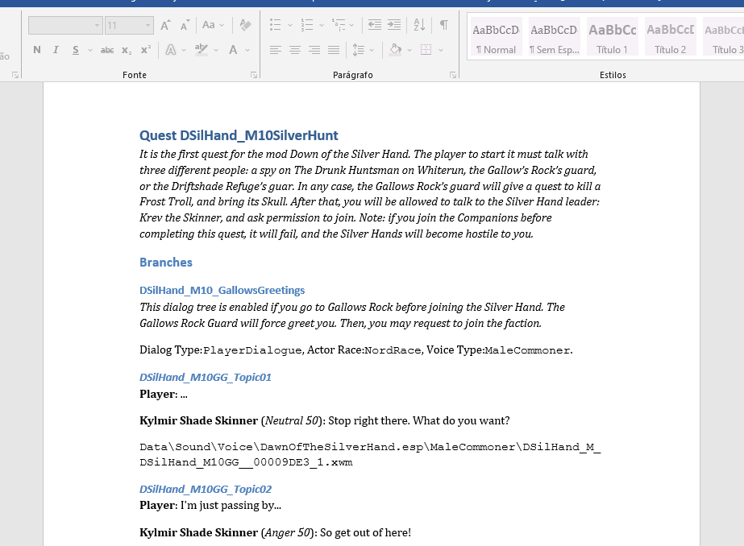
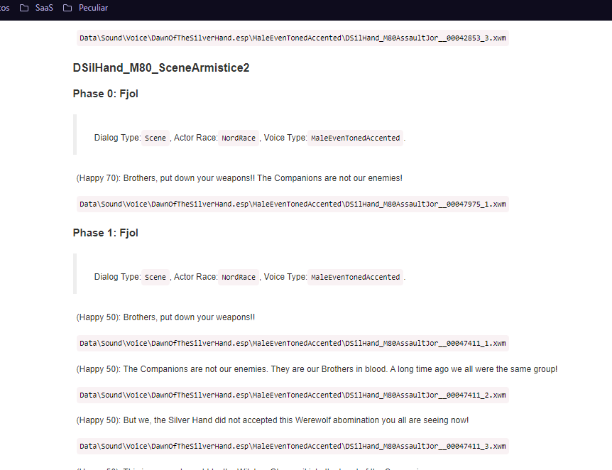
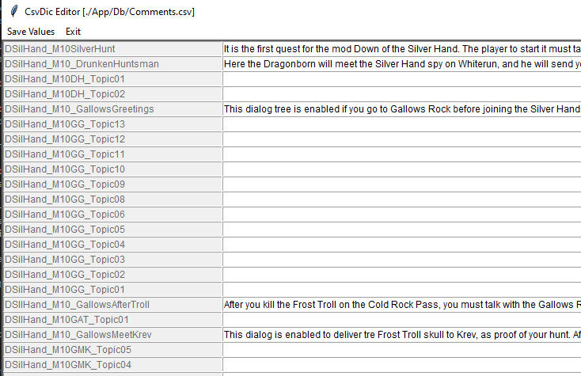
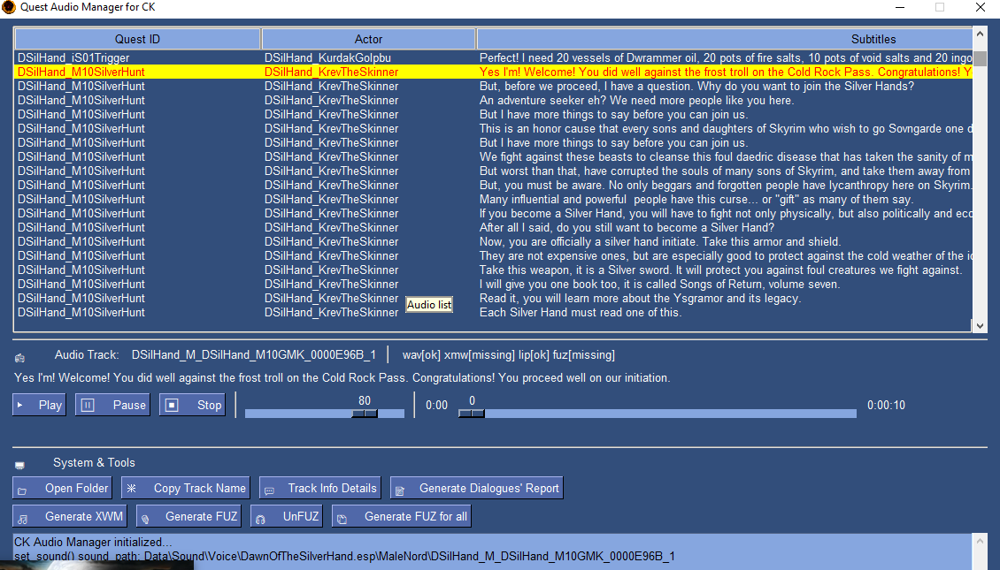
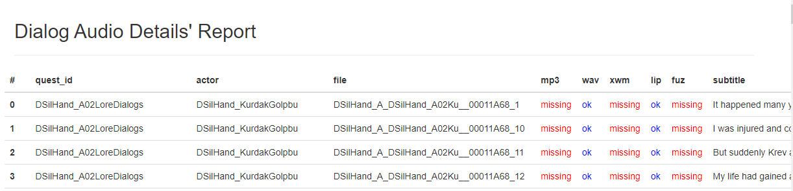

# :fleur_de_lis: CreationKit-DialogDocGen :fleur_de_lis:

Managing quest dialogs in the Creation Kit sucks. Any of these tasks is really a pain:

* Reviwer the text of yor quest dialogs

* Share with your friends of partner the dialogs of yor quest in a format readable by HUMANS.

* Listen the dialog tracks of each dialog in a simple way

* Convert the audio tracks from mp3 to wav to xwm to fuz, and check if any of these files are missing.

For this trask, I created the QuestDialogManager, a tool that address all this issues. For this task, I use CSV files that can be exported by Creation Kit and some more tricks.

What you can do:

* **Generate a "quest screenplay" in a readable and editable formats by HUMANS**:
    * HTML
    * Docx
    * Markdown

* **As any good screenplay, you can add comments and details for any Quest, Branch, Scene and Topic object**. _These comments are saved in a different database, sou they will never be lost for that Quest, Branch Scene or Topic_.

* Want to listen to your audio, WITH subtitles? Just search for it and press play!

* Check if any of your tracks are missing, using a report!

* You dialog record is in mp3 format? No trouble, just place it in the right **folder** with the **right name**!

* Hard to spot the right name? Not anymore. Just select your dialog in the table, and copy to the clipboard the file name, and open the right folder.

* Convert the files between any format. mp3 to wav to xwm to fuz. Or unfuz (fuz to lip + xwm) if you want to.

* Mass convertion to fuz and xwm formats. The convertion may take some minutes, but will use all the cores oy your computer, so it will be as fast as possible.

* If this blue-theme color is not good for you, there a dozens more to be choosen. 

